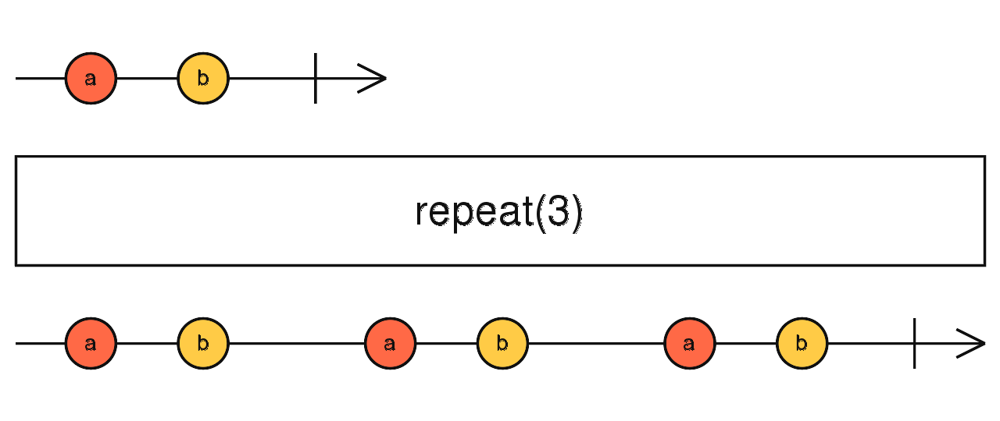

class: center, middle

# Sane Asynchronous Programming with RxJS

---
class: center, middle

# ~~Sane Asynchronous Programming with RxJS~~

---
class: center, middle

## Introduction to Reactive Programming with RxJS

---

# whoami

<div style="margin-top: 100px">
.left-column.center[
##Luís Gabriel Lima
]

.right-column[
- BSc and MSc in CS at CIn/UFPE
- Former Software Engineer at INDT
- Functional Programming enthusiast
- RxJS 5 Contributor
]
</div>

.center[
 ... 
#### [@_luisgabriel](http://twitter.com/_luisgabriel) :: [@luisgabriel](http://github.com/luisgabriel)
]

---

# Reactive Programming

.center[
### "Reactive programming is programming with **asynchronous data streams**"
]

--

### A **stream** is a **sequence** of ongoing events **ordered in time**

--

.center[]

.center[<h6 align='center'>source: https://gist.github.com/staltz/868e7e9bc2a7b8c1f754</h6>]

---

# Reactive Extensions (Rx)

### A common **idiom** to express RP across **different platforms**

--

.center[
### Rx.NET
### RxJS
### RxJava
### RxSwift
### ...
]

---

# Observable

### An **object** that represents a **data stream** in Rx

--

```js
const numberStream = Rx.Observable.range(1, 8);

numberStream.subscribe({
  next(x) { console.log(x); },
  error(e) { console.error(e); },
  complete() { console.log('done'); }
});

// => 1
// => 2
// => 3
// => 4
// => 5
// => 6
// => 7
// => 8
// => done
```

---
class: middle, center

# An Observable represents a **collection** of **async values**

---

# Operators

### Methods that perform **calculations** on the **values** emitted by an Observable

--

.half-column[
### **Collection** operations
- map
- reduce
- filter
- concat
- merge
- zip
- flatMap
- take
- ...
]

.half-column[
### **Async** operations
- buffer
- window
- combineLatest
- switchMap
- delay
- throttle
- race
- ...
]

---
class: middle, center


---

# map

.center[

]

--

```js
const numberStream = Rx.Observable.range(1, 3)
    .map(x => x * 10);

numberStream.subscribe(x => console.log(x));
// 10
// 20
// 30
```
--

.center[
### More examples and diagrams of each operator on [reactivex.io/rxjs](http://reactivex.io/rxjs/class/es6/Observable.js~Observable.html)
]

---

# Creating an Observable

### ...that generates a single random number

```js
let randomNumber$ = Rx.Observable.create((observer) => {
    const id = setTimeout(() => {
        observer.next(Math.random());
        observer.complete();
    }, 1000);
    return () => clearTimeout(id);
});

randomNumber$.subscribe({
    next(x) { console.log(x); },
    error(e) { console.error(e); },
    complete() { console.log('done'); }
});

// 0.1619301338497363
// done
```
---

# Creating an Observable

### ...that generates a multiple random numbers

```js
let randomNumber$ = Rx.Observable.create((observer) => {
    const id = setInterval(() => {
        observer.next(Math.random());
    }, 1000);
    return () => clearInterval(id);
});

let sub = randomNumber$.subscribe({
    next(x) { console.log(x); },
    error(e) { console.error(e); },
    complete() { console.log('done'); }
});

setTimeout(() => {
    sub.unsubscribe();
}, 2000);

// 0.20407358744031567
// 0.9618393938889027
```

---

# Observables are Lazy

- Execute code upon **subscription** to set up the underlying data stream
- Execute code upon **disposal** to teardown the underlying data stream

--

# So you can do things like...

.right-column[
- Setup a WebSocket on subscription
- Close the WebSocket on disposal
- Send an AJAX request
- Abort the AJAX request on disposal
- Setup an event listener
- Remove the event listener on disposal
]

--

.left-column[

]

---

# Observables can be **repeated** and **retried**

.center[

]

```js
const repeated$ = Rx.Observable.range(0, 1)
    .repeat(3);

repeated$.subscribe(value => console.log(value));
// 0
// 1
// 0
// 1
// 0
// 1
```

---
class: middle, center

# Code Example!

---
class: middle, center

# Application Development

---

# How does your data flow through your app?

--

### What events cause variables to be produced

### How those variables are used and for what?

### Which variables are updated and by what?

--

.center[
## RxJS makes this easier to reason about
]

--

.center[
## (with practice)
]

---

# Thinking in Streams

### Any variable in your system which its value changes over time

### Track what changes its value -- an event? another variable?

--

```js
// ...
let c = a + b;
doSomething(c);
// ...
```

--

```js
// ...
const c$ = a$.combineLatest($b, (a, b) => a + b);
c$.subscribe(doSomething);
// ...
```
--

.center[
### **Identify your dependencies → go backwards creating streams**
]
---

# What Operators Should I Use?

### 1. Use the operator guide at [reactivex.io/rxjs](http://reactivex.io/rxjs)
### 2. Remember you don't have to Rx everything
### 3. Use the operators you know and do the rest imperatively

--

.center[
## Start with these:
### map, filter, scan, flatMap, switchMap, combineLatest, concat, do
]

---

# This talk just scratches the surface...

.center[
### Hot vs Cold Observables
### Error Handling and Propagation
### Multicast
### Subjects
### Schedulers
### Custom Operators
]
---

# References

##### [RxJS and Reactive Programming](https://youtu.be/yk_6eU3Hcwo) by Ben Lesh
##### [RxJS 5 Thinking Reactively](https://youtu.be/3LKMwkuK0ZE) by Ben Lesh
##### [The introduction to Reactive Programming you've been missing](https://gist.github.com/staltz/868e7e9bc2a7b8c1f754) by André Staltz
##### [RxJS 5 official documentation](http://reactivex.io/rxjs/)

--

.center[
# Thanks Ben!
]

---

# Resources

##### [Your Mouse is a Database](http://queue.acm.org/detail.cfm?id=2169076)
##### [Deprecating the observer pattern](https://infoscience.epfl.ch/record/148043/files/DeprecatingObserversTR2010.pdf)
##### [End to End Reactive Programming at Netflix](https://www.infoq.com/presentations/netflix-rx-extensions)
##### [Functional Reactive Programming with RxJava](https://youtu.be/_t06LRX0DV0)
##### [Learning Observable By Building Observable](https://medium.com/@benlesh/learning-observable-by-building-observable-d5da57405d87)
##### [RxJS Evolved](https://youtu.be/QhjALubBQPg)
##### [RxJS Version 5](https://youtu.be/COviCoUtwx4)
##### [RxJS 5 Thinking Reactively](https://youtu.be/3LKMwkuK0ZE)
##### [RxJS + Redux + React = Amazing!](https://www.youtube.com/watch?v=AslncyG8whg)

---

# Who to Follow

#### [@headinthebox](https://twitter.com/headinthebox) - Erik Meijer (Rx)
#### [@jhusain](https://twitter.com/jhusain) - Jafar Husain (RxJS, TC-39)
#### [@mattpodwysocki](https://twitter.com/mattpodwysocki) - Matthew Podwysocki (RxJS)
#### [@benlesh](https://twitter.com/BenLesh) - Ben Lesh (RxJS 5)
#### [@trxcllnt](https://twitter.com/trxcllnt) - Paul Taylor (RxJS 5)
#### [@andrestaltz](https://twitter.com/andrestaltz) - André Staltz (RxJS 5, xstream, Cycle.js)
#### [@_jayphelps](https://twitter.com/_jayphelps) - Jay Phelps (RxJS 5, redux-observable)
#### [@benjchristensen](https://twitter.com/benjchristensen) - Ben Christensen (RxJava)

---
class: middle, center

# Thanks!
